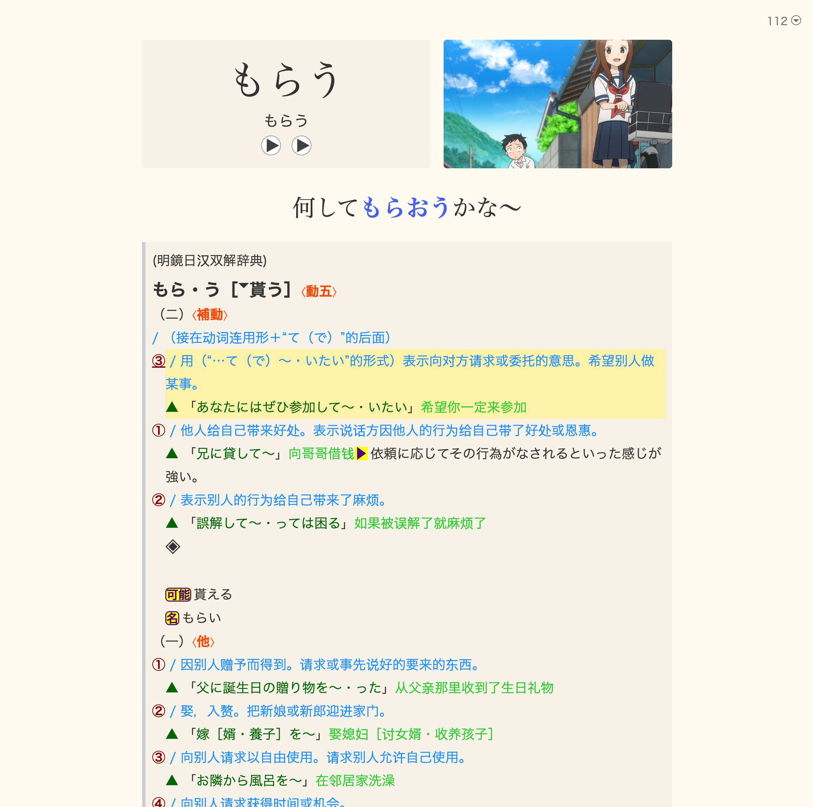
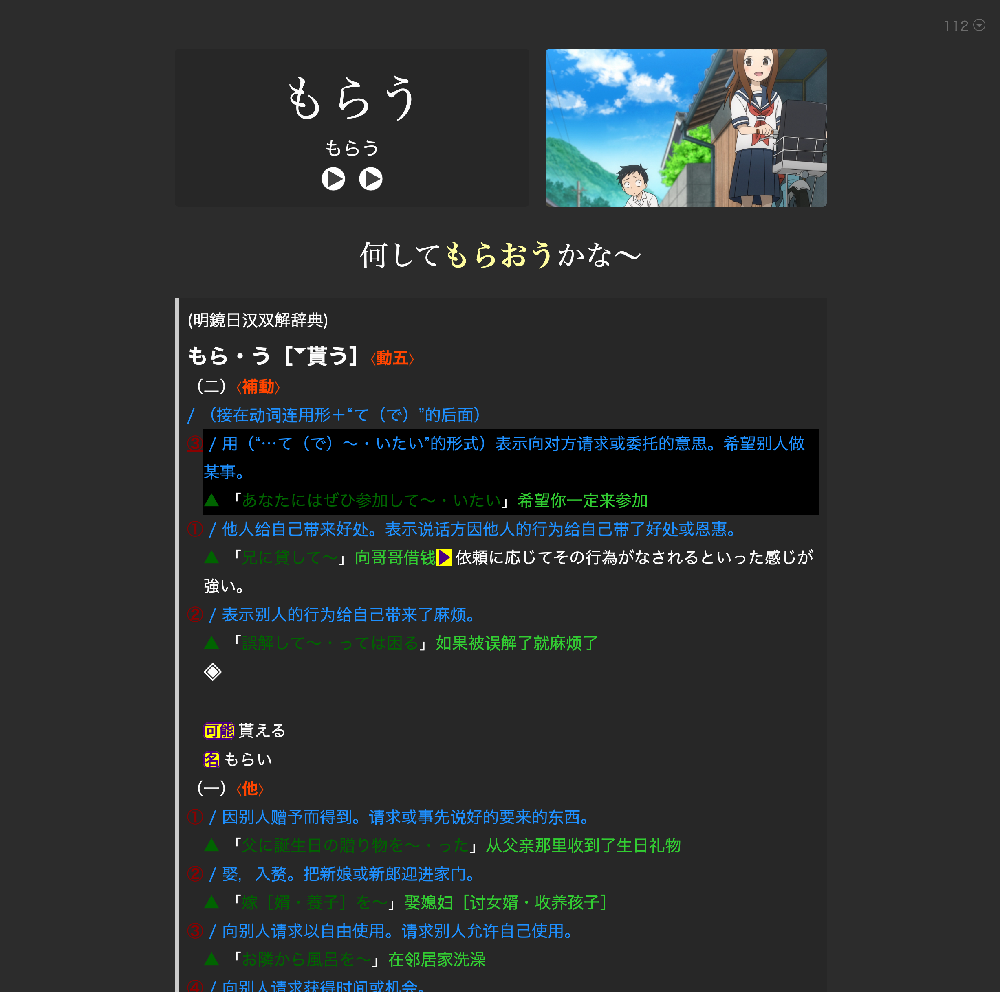

# Pin Definition By Underline

> 为 [Lapis](https://github.com/donkuri/lapis) Anki 笔记模板提供的智能释义置顶脚本

[](CHANGELOG.md)
[](LICENSE)
[](https://nodejs.org/)

## 📖 简介

这是一个为 [Lapis Anki 笔记模板](https://github.com/donkuri/lapis)增强功能的脚本，专门用于处理**基于明镜日汉双解词典 Yomitan 1.4.4 版本**制作的词汇卡片。

当你在 Anki 卡片的释义中使用下划线 `<u>` 标记特定释义的编号时，这个脚本能够自动识别并将该释义**置顶并高亮显示**，让你在复习时快速聚焦到最相关的定义。

### ✨ 核心特性

- 🎯 **智能识别** - 自动识别完整的释义块边界（包括 `def0`/`def1` 结构、编号释义和子释义）
- 🔄 **智能重排** - 维护明镜词典的层级结构和语义完整性
- 🎨 **视觉高亮** - 用黄色背景标记你关注的目标释义
- 🚀 **自动置顶** - 将相关释义块移到卡片最顶部，提高复习效率
- ✅ **完整测试** - 9 个测试用例覆盖明镜词典的各种复杂结构
- 🔧 **Lapis 兼容** - 专为 Lapis 笔记模板的 DOM 结构优化

### 📸 效果展示

<table>
<tr>
<td width="50%">
<b>浅色模式</b><br/>

</td>
<td width="50%">
<b>深色模式</b><br/>

</td>
</tr>
</table>

*✨ 目标释义被自动置顶并用黄色背景高亮显示，让你在复习时一眼看到最相关的定义*

## 🚀 快速开始

### 前置要求

- ✅ 已安装 [Anki](https://apps.ankiweb.net/)
- ✅ 已安装 [Lapis 笔记模板](https://github.com/donkuri/lapis)
- ✅ 使用明镜日汉双解词典（Yomitan 1.4.4）制作卡片
- ✅ 在需要置顶的释义的编号上添加了 `<u>` 下划线标记

### 使用方法

⚠️ **重要**：本脚本不支持独立使用，必须集成到 Lapis 模板中。

#### 集成到 Lapis 模板

**步骤**：
1. 在 Anki 中打开「卡片管理」
2. 选择 Lapis 笔记类型
3. 点击「卡片」按钮进入模板编辑
4. 在「Template」标签页中找到 `initialize()` 函数
5. 在 `initialize()` 函数内部添加 `pinByUnderline()` 调用

**具体操作**：
```javascript
function initialize() {
    splitTags();
    handlePitches();
    setUpDefToggle();
    clickImages();
    formatFrequencyList();
    setDHHeight();
    hideCorrectDefinition();
    movePrimaryDicts();
    userSettings();
    pinByUnderline();  // ← 在这里添加
    //在此调用新的函数
}
```

**添加函数代码**：
1. 将 `script.js` 中的 `pinByUnderline()` 函数完整复制
2. 粘贴到 Lapis 模板的 Template 区域（在 `initialize()` 函数之前）
3. 在 `initialize()` 函数中调用 `pinByUnderline()`

#### 开发测试（可选）

如果你要修改或测试脚本：

```bash
# 安装依赖
npm install

# 运行测试
./test.sh

# 查看帮助
./test.sh --help
```

## 💡 使用示例

### 场景：日语词汇挖掘复习

假设你在使用 Lapis 和明镜词典学习日语时，通过 [Yomitan](https://github.com/yomidevs/yomitan) 挖掘了词汇「**載る**」到 Anki。明镜词典给出了多个释义：

**Anki 卡片原始顺序：**
```
① （人、物が乗り物などに）乗る
② （新聞・雑誌などに）掲載される、載せられる  👈 这是你遇到的语境
③ （波などに）乗る
```

**在释义②的编号上添加下划线 `<u>②</u>` 后，Lapis 模板会自动调用函数，将释义②置顶并高亮显示：**
```
② （新聞・雑誌などに）掲載される、載せられる  ⬅️ 自动置顶 + 黄色高亮
① （人、物が乗り物などに）乗る
③ （波などに）乗る
```

这样在复习时，你会立刻看到最相关的释义，提高学习效率。

## 🔧 工作原理

### 1. 定位目标释义

```
.yomitan-glossary 容器
  └─> <u> 下划线元素
      └─> div[data-sc-class="def1"] 目标释义
          └─> div[data-sc-class="mjrhsjcd-entry"] 词条容器
              └─> li[data-dictionary] 词典条目
```

### 2. 智能块识别

脚本识别两种释义块结构：

#### A. def0 块（带块标记）
```html
<div data-sc-class="def0">（二）⟨副⟩</div>  ← 块起点
<div data-sc-class="def1">说明文字</div>
<div data-sc-class="def1"><span data-sc-class="num">①</span> ...</div>
<div data-sc-class="def1"><span data-sc-class="num">②</span> ...</div>
```

#### B. def1 块（无块标记）
```html
<div data-sc-class="def1">
    <span data-sc-class="num">①</span> 主释义
</div>  ← 块起点
<div data-sc-class="def1">子释义 a</div>
<div data-sc-class="def1">子释义 b</div>
```

### 3. 智能重排

#### 策略 A：def0 块（如 `（一）⟨名⟩`）
**原则**：块标记保持最前，区分说明文字和编号项

```
原始：（一）说明①②③
目标：②
结果：（一）说明②①③  // 说明保持在前，②在编号项中第一
```

#### 策略 B：def1 块（如 `③㋐㋑`）
**原则**：块起点保持最前，目标紧跟其后

```
原始：③㋐㋑
目标：㋑
结果：③㋑㋐  // ③保持，㋑在子项中第一
```

### 4. 特殊情况处理

#### 子释义完整性
当target是子释义时，确保主释义和所有子释义作为整体移动：

```
原始：（二）①②㋐㋑
目标：㋐（子释义）
结果：（二）①㋐㋑②  // ①㋐㋑作为整体移动
```

## 📁 项目结构

```
pin-definition-by-underline/
├── script.js           # 核心脚本
├── test.js             # 自动化测试
├── test.sh             # 测试管理脚本
├── README.md          # 项目文档
├── CHANGELOG.md        # 版本历史
├── CONTRIBUTING.md     # 贡献指南
├── package.json        # 依赖配置
├── .gitignore          # Git 忽略规则
├── cases/              # 测试用例（9个）
│   ├── いい加減.html
│   ├── くれる.html
│   ├── はずす.html
│   ├── まさか.html
│   ├── 一体.html
│   ├── 代.html
│   ├── 回転.html
│   ├── 易い.html
│   └── 載る.html
├── test-output/        # 测试输出（gitignore）
└── test-report.md      # 测试报告（gitignore）
```

## 🧪 测试

### 运行测试套件

```bash
# 完整测试
./test.sh

# 测试选项
./test.sh --clean    # 清理输出
./test.sh --report   # 生成报告
./test.sh --help     # 查看帮助
```

### 测试覆盖

| 测试用例 | 测试场景 | 预期结果 |
|---------|---------|---------|
| いい加減 | def0块识别 | ✅ 通过 |
| くれる | def0块内子释义 | ✅ 通过 |
| はずす | 多连续编号项 | ✅ 通过 |
| まさか | def0优先级 | ✅ 通过 |
| 一体 | def0块重排 | ✅ 通过 |
| 代 | def0标记保持 | ✅ 通过 |
| 回転 | def1块重排 | ✅ 通过 |
| 易い | def1子释义 | ✅ 通过 |
| 載る | 独立块识别 | ✅ 通过 |

**测试结果**：9/9 通过 ✅

## 🎯 核心设计原则

1. **def0 绝对优先** - 块标记（如 `（一）⟨名⟩`）始终是最高优先级
2. **就近原则** - 对于 def1 块，使用最近的有编号的释义
3. **语义完整性** - 主释义和子释义必须作为整体移动
4. **层级保持** - 维护原有的释义层级结构
5. **分支完整性** - 每个处理分支都考虑所有可能的子情况

## 📊 技术细节

### 关键算法

**块起点识别**（支持两种策略）：

```javascript
// 策略取决于 target 是否有编号
const targetHasNum = targetDef.querySelector('span[data-sc-class="num"]');

if (targetHasNum) {
    // Target 是独立释义
    // 向前查找 def0，遇到其他独立释义停止
} else {
    // Target 是子释义
    // 向前查找最近的主释义或 def0
}
```

### DOM 结构依赖

脚本依赖明镜日汉双解词典（Yomitan 1.4.4）特定的 DOM 结构：

| 选择器 | 说明 | 示例 |
|--------|------|------|
| `.yomitan-glossary` | Yomitan 词典内容容器 | Lapis 卡片的释义区域 |
| `div[data-sc-class="def0"]` | 块标记（词性/类别） | `（一）⟨名⟩`、`（二）⟨副⟩` |
| `div[data-sc-class="def1"]` | 释义内容 | 主释义和子释义 |
| `span[data-sc-class="num"]` | 释义编号 | `①`、`②`、`㋐`、`㋑` |
| `div[data-sc-class="mjrhsjcd-entry"]` | 明镜词条容器 | 整个词条的包装元素 |
| `li[data-dictionary]` | 词典条目 | Anki/Lapis 的词典列表项 |

## 📝 兼容性

- ✅ **Lapis 笔记模板** - 专为 [Lapis](https://github.com/donkuri/lapis) 优化
- ✅ **明镜日汉双解词典** - Yomitan 1.4.4 版本
- ✅ **Anki 平台** - 桌面版和 AnkiWeb
- ✅ **现代浏览器** - 支持 ES6+（Chrome、Firefox、Safari 等）
- ⚠️ **DOM 结构依赖** - 依赖明镜词典的 `data-sc-class` 属性
- ⚠️ **其他词典** - 可能需要根据不同词典的 DOM 结构调整代码

## ⚠️ 注意事项

1. **集成要求** - ⚠️ **脚本不支持独立使用**，必须集成到 Lapis 模板的 `initialize()` 函数中
2. **标记方式** - 需要在 Anki 卡片编辑时，给释义编号添加 `<u>` 标签（如 `<u>②</u>`）
3. **词典要求** - 目前仅支持明镜日汉双解词典（Yomitan 1.4.4）的 DOM 结构
4. **Lapis 模板** - 脚本专为 Lapis 笔记模板优化，其他模板可能需要调整
5. **模板修改** - 修改 Lapis 模板会影响所有使用该模板的卡片
6. **性能考虑** - 脚本在卡片加载时自动执行，无需手动调用

## 📜 版本历史

当前版本：**v1.11** (2025-10-14)

查看完整版本历史和更新日志：[CHANGELOG.md](CHANGELOG.md)

### 最新更新

- ✅ 完善 def0 块中子释义处理逻辑
- ✅ 支持主释义和子释义作为整体移动
- ✅ 添加完整的自动化测试套件
- ✅ 9 个测试用例全部通过

## 🤝 贡献

欢迎提交 Issue 和 Pull Request！

详细的贡献指南请查看 [CONTRIBUTING.md](CONTRIBUTING.md)，包括：
- 📖 文档结构说明
- 🚀 开发环境配置
- 📝 提交规范
- 🧪 测试规范
- 📄 文档维护指南
- 🎯 代码规范